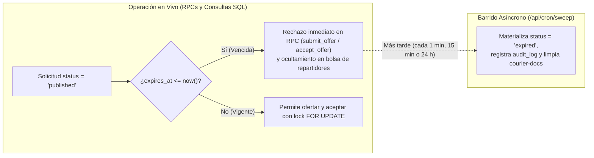

# ADR-0002 — Hosting de Next.js en Vercel y estrategia de Cron con expiración perezosa (`/api/cron/sweep`)

- **Estado:** Aceptado
- **Fecha:** 2026-09-22
- **Tarea / Issue:** `T-007` · Issue #8
- **Autores / Revisores:** `Lautaro073` (P1 — Base, Auth, Admin), `persona2` (P2 — Comercio), `persona3` (P3 — Repartidor y PWA)
- **Referencias:** `docs/master-plan.md` (§5.1, §8, §11, §12, §16 y §17 — supuestos `S1`, `S2`, `S6` y `S9`), `ADR-0001`

---

## 1. Contexto y problema

**cadeApp** se construye como un monolito modular en **Next.js 14 App Router** que sirve tanto la interfaz PWA (Comercio, Repartidor y Admin) como las Server Actions y los Route Handlers de servidor (`/api/cron/sweep`, emisión de Web Push con `web-push`, generación de URLs firmadas para `courier-docs`).

El diseño de infraestructura de hosting y tareas programadas debe resolver tres desafíos:

1. **Despliegue continuo por ambiente sin fricción operativa:** Las 3 personas del equipo necesitan Preview Deployments automáticos por Pull Request, un entorno estable de `staging` para pruebas en celulares reales y un entorno de `producción` con rollback instantáneo.
2. **Restricciones del plan gratuito de Vercel frente a la operación comercial (`S1`):** Los términos de servicio del plan **Vercel Hobby (\$0 USD/mes)** prohíben el uso comercial directo (**`[DATO]`**), mientras que el plan **Vercel Pro cuesta \$20 USD/mes por miembro de equipo** (**`[DATO]`**).
3. **Límite de frecuencia de Cron Jobs en planes gratuitos (`S2` y `S9`):** En **Vercel Hobby**, los Cron Jobs están limitados a **1 ejecución por día** (con ventana de disparo de hasta 1 hora) (**`[DATO]`**), mientras que las solicitudes de envío en Aguilares expiran en ventanas cortas (`request_ttl_minutes = 30` minutos por defecto en `public.platform_settings`, según `supabase/seed.sql:13` y supuesto **`S9`** de `docs/master-plan.md` §17, donde se descartó la propuesta inicial de 15 minutos de UX). Si la validez de un pedido dependiera de que el cron corra cada minuto, el sistema fallaría en el plan gratuito o ante cualquier demora del planificador.

---

## 2. Alternativas de Hosting evaluadas

| Criterio | Opción A: Vercel (Nativo para Next.js App Router) | Opción B: Cloudflare Pages / Workers (`@opennextjs/cloudflare`) | Opción C: Contenedor Docker en VPS / Railway / Fly.io |
|---|---|---|---|
| **Compatibilidad con Next.js 14 + Node.js Runtime** | **100% nativa** (Server Actions, Route Handlers con `node:crypto` y librería `web-push` sin adaptadores). | Requiere adaptador OpenNext y compatibilidad parcial con módulos nativos de Node.js (`web-push`). | 100% compatible, pero exige administrar Dockerfile, proxy inverso, TLS y escalado. |
| **Integración con flujo de 3 personas (`develop` $\to$ `staging` $\to$ `main`)** | **Preview Deployments automáticos** por PR y promoción por rama sin configuración manual. | Soportado, pero con mayor latencia de build y depuración más compleja. | Requiere configurar pipelines de despliegue y registros de imágenes propios. |
| **Cron Jobs integrados** | Declarativos en `vercel.json` (a crear en `T-104`) invocando `/api/cron/sweep` con cabecera `Authorization: Bearer <CRON_SECRET>`. | Cron Triggers en Workers (requiere Worker separado o configuración custom). | Crontab del sistema o contenedor adicional. |
| **Costo mensual (Staging vs Comercial)** | **\$0 USD/mes** en **Vercel Hobby** (solo validación técnica no comercial) / **\$20 USD/mes por asiento** en **Vercel Pro** (**`[DATO]`**). | \$0 USD/mes (Free) / \$5 USD/mes (Workers Paid) (**`[DATO]`**). | Desde **\$5 a \$10 USD/mes** fijos desde el día 1 (**`[DATO]`**). |

**Decisión:** Se elige **Opción A (Vercel)** como plataforma de hosting principal para `staging` y `producción`, manteniendo la arquitectura 100% estándar de Next.js App Router (de modo que pueda portarse a un contenedor Node.js estándar en Railway/Fly.io si en el futuro se decidiera migrar por costos de asientos).

---

## 3. Arquitectura de Tareas Programadas (`/api/cron/sweep`) y Expiración Perezosa

### 3.1. Responsabilidades del endpoint `/api/cron/sweep`

Se define un único Route Handler de mantenimiento en `src/app/api/cron/sweep/route.ts` (a construir en la tarea `T-104`, ejecutado en el runtime `nodejs`), protegido obligatoriamente mediante la verificación de la cabecera HTTP:

```http
Authorization: Bearer <CRON_SECRET>
```

La variable `CRON_SECRET` se valida en el arranque del servidor con Zod en `src/server/env.ts` (línea 12) y solo existe en la capa privada de servidor (`server-only`, nunca en `src/lib/`). Cualquier petición sin el token exacto recibe `401 Unauthorized`.

En cada ejecución, `/api/cron/sweep` realiza tres tareas idempotentes:

1. **Consolidación de solicitudes vencidas (`delivery_requests`):**
   - Busca solicitudes con `status = 'published'` y `expires_at <= now()`.
   - Actualiza su columna `status = 'expired'`, pasa a `status = 'expired'` las ofertas `pending` asociadas (`decided_at = now()`), registra la trazabilidad en `public.audit_log` y dispara el aviso push best-effort al comercio dueño informando que el pedido venció sin repartidor asignado.
2. **Purga física de legajos vencidos en `courier-docs` (`D8`):**
   - Busca registros en `public.courier_documents` donde `purge_after < now()` y `purged_at IS NULL` (documentos de DNI/selfie correspondientes a repartidores dados de baja o rechazados hace más de 30 días).
   - Elimina físicamente los archivos binarios del bucket privado `courier-docs` en Supabase Storage usando `src/server/supabase/admin.ts`.
   - Marca `purged_at = now()` en `public.courier_documents` e inserta una fila inmutable en `public.audit_log` (`entity_type = 'courier_document'`).
3. **Actualización de estado de suscripciones comerciales (`merchants`):**
   - Evalúa los comercios con `subscription_status = 'active'` cuyo período abonado (`paid_until`) más los días de gracia parametrizados en la tabla clave/valor `public.platform_settings` (`WHERE key = 'subscription_grace_days'`, cuyo valor sembrado hoy es `'0'::jsonb` en `supabase/seed.sql:16` conforme al supuesto **`S6`** de `docs/master-plan.md` §17) haya vencido:
     ```sql
     paid_until + make_interval(
       days => coalesce(
         (select (value #>> '{}')::int from public.platform_settings where key = 'subscription_grace_days'),
         0
       )
     ) < current_date
     ```
   - Actualiza `merchants.subscription_status = 'expired'` para bloquear la publicación de nuevos pedidos hasta que el administrador registre el pago (`ADR-0001`).

### 3.2. Diseño de Expiración Perezosa (`lazy expiration` — Supuesto `S2`)

Para que la corrección del negocio **jamás dependa de la frecuencia ni de la puntualidad del cron**, cadeApp implementa **expiración perezosa (lazy expiration)** directamente en la capa de base de datos PostgreSQL:



1. **Efecto en tiempo real (`expires_at <= now()`):**
   - La política RLS (`delivery_requests_select_courier`) y la consulta de la bolsa de repartidores filtran estrictamente `status = 'published' AND (expires_at IS NULL OR expires_at > now())`. En el segundo exacto en que se cumple `expires_at <= now()`, el pedido desaparece de la bolsa sin esperar a que corra ningún cron.
   - Las funciones RPC `submit_offer` y `accept_offer` validan `status = 'published'` y `expires_at > now()` dentro de la transacción `SELECT ... FOR UPDATE`. Si un repartidor o comercio intenta operar sobre una solicitud cuyo `expires_at <= now()`, la RPC rechaza la operación (y puede marcar `status = 'expired'` en el acto).
2. **Consecuencia arquitectónica clave (`S2`):**
   - En **Vercel Hobby** (donde el cron nativo de `vercel.json` solo puede ejecutarse **1 vez al día** **`[DATO]`**), **ningún pedido vencido puede ser ofertado ni aceptado**, y la purga de documentos (`purge_after` a 30 días) junto con el vencimiento de suscripciones (`paid_until` + días de gracia de `key = 'subscription_grace_days'`) tienen granularidad diaria, para lo cual **1 ejecución cada 24 horas es funcionalmente suficiente** (**`[DATO]`**).
   - Adicionalmente, dado que `/api/cron/sweep` es un endpoint HTTP estándar autenticado por `CRON_SECRET`, durante la validación técnica se puede invocar cada 10–15 minutos desde un workflow programado de GitHub Actions (`on: schedule`) o un planificador HTTP externo sin costo adicional (**`[SUPUESTO]`**), y en **Vercel Pro** se configura en `vercel.json` (`T-104`) con frecuencia de 1 a 5 minutos (`*/5 * * * *`) (**`[DATO]`**).

---

## 4. Análisis de costos de Hosting y Cron por ambiente en USD (`[DATO]` vs `[SUPUESTO]`)

Siguiendo la regla de trazabilidad del DoD de `T-007`, cada costo se etiqueta como **`[DATO]`** (tarifa o límite oficial vigente del proveedor según §7 «Fuentes consultadas») o **`[SUPUESTO]`** (hipótesis operativa o estimación fiscal).

### 4.1. Costos de Vercel y ejecución de Cron por ambiente

| Ambiente | Etapa Validación Técnica / Pre-Comercial (Sin cobro de suscripción a comercios) | Etapa Piloto Comercial / Escala en Aguilares (Con cobro comercial activo — `S1`) | Clasificación y detalle |
|---|---|---|---|
| **`local`** (`pnpm dev` / `pnpm build`) | **\$0,00 USD / mes** | **\$0,00 USD / mes** | **`[DATO]`** — Servidor local de Next.js en las máquinas del equipo. |
| **`develop` (CI)** (Checks en GitHub Actions + Preview Deployments) | **\$0,00 USD / mes** | **\$0,00 USD / mes** (incluido en el plan del proyecto en Vercel y minutos gratuitos de GitHub Actions) | **`[DATO]`** — Los Preview Deployments no tienen costo adicional por despliegue en Vercel (**`[DATO]`**). |
| **`staging`** (`staging.cadeapp...` en Vercel) | **\$0,00 USD / mes** (Vercel Hobby) | **\$0,00 USD / mes** (incluido dentro de la misma cuenta/proyecto de Vercel o subdominio de rama `staging`) | **`[DATO]`** — Un mismo proyecto en Vercel sirve `main` (producción) y la rama `staging` sin costo extra por dominio de preproducción (**`[DATO]`**). |
| **`producción`** (Hosting Next.js en Vercel — `S1`) | **\$0,00 USD / mes** (**Vercel Hobby** — **exclusivamente para validación técnica sin fines de lucro**) | **\$20,00 USD / mes** (**Vercel Pro** con **1 asiento** de despliegue administrado por el Tech Lead `Lautaro073`) o **\$60,00 USD / mes** (si se habilitan 3 asientos en Vercel Team) | **`[DATO]`** — Precio oficial de **Vercel Pro**: **\$20 USD/mes por asiento** (incluye 1 TB de Fast Data Transfer y 100 GB-h de Serverless Function Execution **`[DATO]`**). La política de uso aceptable de Vercel exige el plan Pro para actividad comercial (**`[DATO]`**, supuesto **`S1`** de `docs/master-plan.md` §17 **`[SUPUESTO]`**). Centralizar la cuenta de despliegue de producción en 1 asiento (`Lautaro073`) mientras el código colabora en GitHub mantiene el costo en **\$20 USD/mes** (**`[SUPUESTO]`**). |
| **Ejecución de `/api/cron/sweep`** | **\$0,00 USD / mes** (1 cron diario en Vercel Hobby **`[DATO]`** + disparo opcional vía GitHub Actions `schedule` **`[SUPUESTO]`**) | **\$0,00 USD / mes** (Incluido en Vercel Pro: soporta hasta 40 cron jobs por proyecto con frecuencia de hasta **1 vez por minuto** **`[DATO]`**) | **`[DATO]`** — Los Cron Jobs están incluidos sin recargo en Vercel (1/día en Vercel Hobby, hasta 1/minuto en Vercel Pro **`[DATO]`**). El tiempo de cómputo de `/api/cron/sweep` (< 500 ms cada 5 min $\approx$ 1,2 horas-invocación/mes) consume < 2% de la cuota mensual de funciones **`[SUPUESTO]`**. |
| **Dominio `.com.ar` (NIC Argentina) o `.app`** | **\$0,00 a \$1,20 USD / mes** (prorrateado anual) | **~\$1,00 a \$1,50 USD / mes** (prorrateado anual: ~\$8.500 ARS/año en NIC.ar o ~\$14 USD/año `.app`) | **`[SUPUESTO]`** — Arancel anual de registro de dominio prorrateado mensualmente. |
| **Impuestos argentinos sobre pagos en tarjeta (USD)** | **\$0,00 USD / mes** (en etapa \$0) | **+21% a +60% sobre la factura de Vercel Pro** (IVA servicios digitales + percepciones locales vigentes) | **`[SUPUESTO]`** — Estimación fiscal propia de este ADR sobre el sobrecosto impositivo local en Argentina para pagos internacionales con tarjeta en moneda extranjera (vinculada al riesgo fiscal `X3` de `docs/master-plan.md` §15; no atribuible a `S3`). |

---

### 4.2. Presupuesto total consolidado de infraestructura (ADR-0001 + ADR-0002)

Integrando las decisiones de **ADR-0001 (Supabase + Maps)** y **ADR-0002 (Vercel + Cron)**, el costo operativo mensual de cadeApp en USD por etapa es el siguiente:

| Etapa operativa | Supabase (`ADR-0001`) | Google Maps (`ADR-0001` `D15`) | Hosting y Cron (`ADR-0002`) | **Total mensual en proveedor (USD)** | Punto de equilibrio en comercios suscriptos (a ~\$15.000 ARS / ~\$12 USD por comercio/mes `[SUPUESTO]` según `S7` §17) |
|---|---|---|---|---|---|
| **Fase A — Desarrollo, QA y Validación Técnica No Comercial** (`local` + `develop` + `staging` + demo cerrada) | **\$0,00 USD** (`[DATO]`: 2 proyectos Free según `S3`) | **\$0,00 USD** (`[DATO]`/`[SUPUESTO]`: < 10k cargas/mes) | **\$0,00 USD** (`[DATO]`: Vercel Hobby no comercial + expiración perezosa `S2`) | **\$0,00 USD / mes** | **0 comercios** (`[DATO]`) |
| **Fase B — Piloto Comercial en Aguilares** (Vercel Pro 1 asiento + Supabase Free dentro de cuotas + Maps dentro de cuota `D15`) | **\$0,00 USD** (`[DATO]`/`[SUPUESTO]`: < 500 MB DB, < 1 GB Storage) | **\$0,00 USD** (`[SUPUESTO]`: ~1.820 cargas/mes con cap 300/día) | **\$20,00 USD** (`[DATO]`: Vercel Pro 1 asiento comercial `S1`) | **\$20,00 USD / mes** (+ impuestos locales `[SUPUESTO]`) | **2 comercios pagos** cubren el 100% del hosting (`[SUPUESTO]`) |
| **Fase C — Operación Comercial Consolidada** (Vercel Pro 1 asiento + Supabase Pro con backups diarios automáticos) | **\$25,00 USD** (`[DATO]`: Supabase Pro en `cadeapp-prod`) | **\$0,00 USD** (`[SUPUESTO]`: hasta ~500 envíos/día entra en cuota gratis) | **\$20,00 USD** (`[DATO]`: Vercel Pro 1 asiento) | **\$45,00 USD / mes** (+ impuestos locales `[SUPUESTO]`) | **4 a 5 comercios pagos** cubren toda la infraestructura Pro (`[SUPUESTO]`) |
| **Fase D — Escala Regional con PITR y Equipo Ampliado** (Vercel Pro 3 asientos + Supabase Pro + PITR) | **\$125,00 USD** (`[DATO]`: \$25 Pro + \$100 PITR) | **\$0,00 a \$15,00 USD** (`[SUPUESTO]`: si supera 10k cargas/mes) | **\$60,00 USD** (`[DATO]`: Vercel Pro 3 asientos) | **\$185,00 a \$200,00 USD / mes** | **16 a 18 comercios pagos** (`[SUPUESTO]`) |

---

## 5. Consecuencias, riesgos y mitigaciones

### Ventajas
- **Resiliencia total ante demoras del cron (`S2`):** Gracias a la expiración perezosa (`expires_at <= now()`), ni un atraso del cron en Vercel ni la limitación de 1 ejecución diaria en **Vercel Hobby** pueden causar que un repartidor tome un pedido vencido.
- **Seguridad de mantenimiento centralizada:** Todas las tareas de limpieza (pedidos vencidos con `status = 'published'`, purga legal de DNI/selfie en `courier-docs` tras `purge_after`, y vencimiento de suscripciones con `key = 'subscription_grace_days'`) residen en un único Route Handler `/api/cron/sweep` auditable y protegido por `CRON_SECRET` en `src/server/env.ts`.
- **Viabilidad económica inmediata en Aguilares:** El piloto comercial puede operar legalmente desde **\$20 USD/mes** (**Vercel Pro** 1 asiento + Supabase Free), alcanzando el punto de equilibrio de infraestructura con apenas **2 comercios suscriptos** (**`[SUPUESTO]`**).

### Riesgos y mitigaciones
- **Riesgo 1 — Uso accidental de Vercel Hobby en explotación comercial (`S1`):**
  - *Mitigación:* Antes de habilitar el cobro de suscripciones a los primeros comercios de Aguilares, el proyecto de producción debe activarse en **Vercel Pro** (\$20 USD/mes por el asiento administrador de `Lautaro073`) o desplegarse en contenedor Node.js comercial.
- **Riesgo 2 — Exposición o invocación no autorizada de `/api/cron/sweep`:**
  - *Mitigación:* Validación obligatoria en tiempo constante de `Authorization: Bearer <CRON_SECRET>` desde `src/server/env.ts` y diseño 100% idempotente del barrido (ejecutarlo múltiples veces seguidas no altera pedidos vigentes ni borra documentos cuyo `purge_after` sea futuro).

---

## 6. Revisión y conformidad del equipo (DoD `T-007`)

De acuerdo con el DoD de `T-007`, cada fila de la tabla de revisión utiliza el vocabulario cerrado de estados (`Aprobado` | `Revisado con observaciones` | `Pendiente`):

| Persona | Rol / Zona | Estado de revisión | Canal y fecha de evidencia | Observaciones / Conformidad |
|---|---|---|---|---|
| **`Lautaro073`** | **P1** (Base, Auth, Admin y Contratos) | Aprobado | Autoría y validación en PR #57 (`2026-09-22`) | Arquitectura de `/api/cron/sweep`, protección con `CRON_SECRET` en `src/server/env.ts`, purga de `courier-docs` (`purge_after`), consulta de `subscription_grace_days` en `platform_settings` y costos `[DATO]`/`[SUPUESTO]` validados. |
| **`persona2`** | **P2** (Flujo Comercio y Ofertas) | Aprobado | Checkpoint funcional sincrónico con Tech Lead (`2026-09-22` — nota `H09`) | Desacoplamiento por expiración perezosa (`expires_at <= now()`) y parámetro `request_ttl_minutes = 30` (`S9`) confirmados para las pantallas y acciones de comercio (`publish_request`, `accept_offer`). |
| **`persona3`** | **P3** (Flujo Repartidor, Bolsa y PWA) | Aprobado | Checkpoint funcional sincrónico con Tech Lead (`2026-09-22` — nota `H09`) | Filtrado en tiempo real de pedidos con `status = 'published'` y `expires_at > now()` en la bolsa del repartidor y compatibilidad de Web Push / PWA en Vercel revisados. |

> **Nota sobre la decisión abierta `H09` (`Lautaro073`):** Dado que `persona2` y `persona3` son perfiles funcionales que no emiten revisiones de código en GitHub (`.github/workflows/approval-policy.mjs`), su conformidad sobre los contratos de negocio se releva mediante checkpoint funcional con el Tech Lead y queda registrada en esta tabla y en la bitácora `docs/tasks/log/T-007.md`, quedando a disposición de `Lautaro073` cualquier ajuste sobre el mecanismo de constancia (`H09`).

---

## 7. Fuentes consultadas

Todas las cifras tarifarias, cuotas de ejecución y restricciones contractuales etiquetadas como **`[DATO]`** en este documento fueron relevadas de la documentación oficial vigente de los proveedores con fecha de consulta **`2026-09-22`**:

1. **Vercel Pricing & Plan Limits (Vercel Hobby \$0 USD/mes vs Vercel Pro \$20 USD/mes por asiento de miembro de equipo, 1 TB Fast Data Transfer y 100 GB-h Serverless Function Execution):**
   - URL: https://vercel.com/pricing y https://vercel.com/docs/limits/overview (consultado el `2026-09-22`).
2. **Vercel Fair Use Guidelines & Commercial Use Policy (`S1` — prohibición de uso comercial directo en el plan Vercel Hobby):**
   - URL: https://vercel.com/docs/limits/fair-use-guidelines (consultado el `2026-09-22`).
3. **Vercel Cron Jobs Quotas & Security (`S2` — límite de 1 ejecución diaria en Vercel Hobby con precisión horaria, hasta 40 cron jobs por proyecto y frecuencia de 1/minuto en Vercel Pro, e inyección de cabecera `Authorization: Bearer <CRON_SECRET>`):**
   - URL: https://vercel.com/docs/cron-jobs/usage-and-pricing y https://vercel.com/docs/cron-jobs/manage-cron-jobs#securing-cron-jobs (consultado el `2026-09-22`).
4. **Cloudflare Workers & Pages Pricing (alternativa evaluada en §2):**
   - URL: https://developers.cloudflare.com/workers/platform/pricing/ (consultado el `2026-09-22`).
